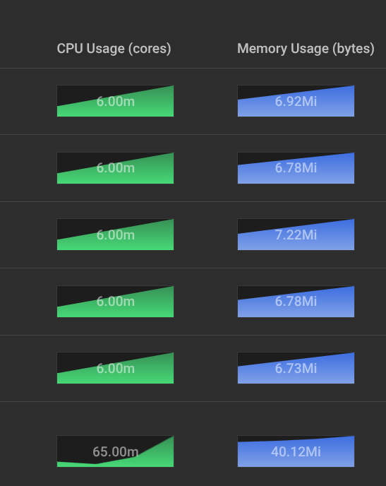
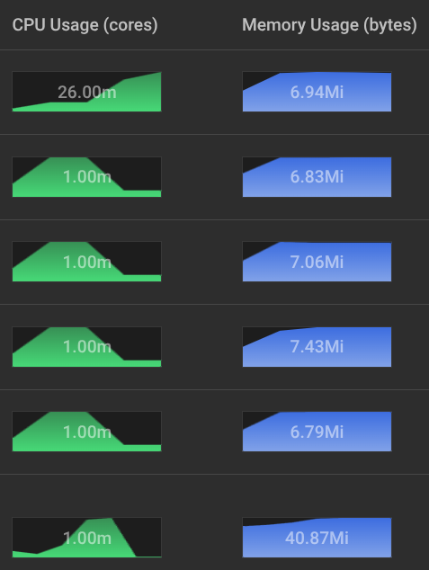

# gRPC Load Balance Test
This repo holds instructions and code to demonstrate a gRPC service that is load balanced in Kubernetes using a [Gateway](https://kubernetes.io/docs/concepts/services-networking/gateway/), implemented with [traefik](https://doc.traefik.io/traefik/).

[Minikube](https://minikube.sigs.k8s.io/docs/) is used to run the demonstration locally.

By using the new Gateway API, GRPCRoute, and Traefik, gRPC services can be deployed and balanced. This gets past the need for [tears](https://kubernetes.io/blog/2018/11/07/grpc-load-balancing-on-kubernetes-without-tears/).

## Prereqs
* [go](https://go.dev/doc/install)
* [kubectl](https://kubernetes.io/docs/tasks/tools/#kubectl)
* [minikube](https://minikube.sigs.k8s.io/docs/start/)
* [helm](https://helm.sh/docs/intro/install/)
* [Docker](https://docs.docker.com/engine/install/)

## Running the demo
### Create a cluster using minikube
1. Start the cluster. This will build a kubernetes cluster using a single node, locally. The method (Docker, VM, etc) is dependent on config and OS.

    This will set your kubectl context to the minikube cluster.
    ```
   minikube start
   ```
2. Enable addons
    ```
   minikube addons enable dashboard
   minikube addons enable metrics-server
   ```
3. Start the dashboard. This will block the terminal it is run in and open a web browser.
    ```
   minikube dashboard
   ```
4. Open a [tunnel](https://minikube.sigs.k8s.io/docs/handbook/accessing/). This is used so the Gateway is accessible from the host machine. This also blocks the terminal it is run in.
    ```
    minikube tunnel
    ```
### Install Traefik to the Cluster
1. Follow the instructions [here](https://doc.traefik.io/traefik/getting-started/install-traefik/#use-the-helm-chart) to install in the cluster.
2. Configure Traefik to enable Gateway and not Ingress.
    ```
   helm upgrade --install --version 36.2.0 --namespace default traefik traefik/traefik -f values.yaml
   ```
### Build and Deploy Image to Cluster
1. Build an image for the server
   ```
   docker build -f Dockerfile -t test-server .
   ```
2. Add the image to the cluster (no remote downloads).
    ```
    eval $(minikube docker-env -u)
    minikube image load test-server:latest
    ```
### Deploy the Kubernetes manifests
1. Deploy
    ```
   kubectl apply -f manifests.yml
   ```
### Configure /etc/hosts
1. Get the IP of the Gateway
   ```
   kubectl get Gateway traefik
   ```
2. Add to /etc/hosts
   ```
   123.123.123.123 echo.test
   ```
### Ping the Server
1. Run the client
   ```
   go run client/main.go
   ```
### Observe the Balance
1. In the browser tab that minikube dashboard opened, open "Pods" and watch as requests are balanced across all 5 pods. It may take a couple minutes for the metrics to update.

   
### Observe the Lack of Balance
1. Port forward directly to the service
   ```
   kubectl port-forward svc/my-service 8000:8000
   ```
2. Run the client, pointed at the port forwarded.
   ```
   go run client/main.go "localhost:8000"
   ```
   Only one pod will get load now.

   
 
### Cleaning Up
1. Delete the cluster
    ```
   minikube delete
   ```
   
### Further Reading
* [Gateway API](https://gateway-api.sigs.k8s.io/)
* [GRPCRoute](https://gateway-api.sigs.k8s.io/guides/grpc-routing/)
